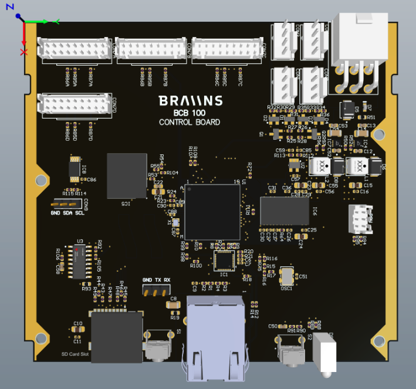

**Product Description**

This is final production release of Braiins BCB100.

**Hardware features**

- Compatible with all s19 models with the exception of Hydro models.
- Easy installation - compatible with the standard enclosures.
- SD Card slot
- LEDs
- Ethernet port
- Immersion ready
- It is based on MPU STM32MP157C/F with part number STM32MP157CAB3. Two core 650MHz A7 with ARM ISA and Cortex M3
  coprocessor. Package is LFBGA354 16x16
- 128 MB RAM and 4GB of eMMC memory
- Ethernet connection is based on Ethernet PHY Microchip 8710 with 10/100 Mb connection
- Main power is 12V with discrete points of 3.3V/1.35 and 0.65V, for the MPU, RAM, eMMC, Ethernet PHY and rest of the
  active components

**Software features**

- Full support of Braiins OS+

**Dimensions**

- Height: 110mm
- Width:100mm
- Weight:  ~130g

By default the board is powered by 12V from the auxiliary part of the PSU with a standard connector.
On the control board there are multiple discrete voltage points for the MPU, RAM, eMMC and Ethernet PHY. Discrete
voltage map contains 12V as the main power supply, 3.3V(eMMC, Ethernet PHY, OP-AMP) for multiple active components,
1.35V for the MPU/RAM and 0.65V for RAM as a reference voltage. MPU on the control board is from ST company with 2 ISA
ARM A7 cores 650 MHZ with M3 co-processor for smooth run.
Package is LFBGA354 16X16 part number STM32MP157CAB3. Operating memory is provided by Micron with a density 128MB. The
control board has two parts which can provide storage and boot capability.
First one is eMMC memory from company Alliance Memory with density 4GB. By default eMMC is chosen as the default boot
option. Second possibility for storage and OS boot is an SD card.
When the SD card is inserted during successful OS boot from eMMC, the MPU must be reset by reset button and after reset
the MPU will boot OS from the SD card.
Ethernet connection is secured by Ethernet PHY from company Microchip. It has a standard 10/100 Mb connection speed.
Board is built on the 6 layer PCB with 4 layers for data connections and 2 layers for power and ground to ensure proper
board running without cross talking or any other types of noise.
The control board mask was chosen black with a silicon layer for marks and signs. Parts on control boards are from both
sides of the board(top and bottom layer).
Current consumption on average is 250 mA.

